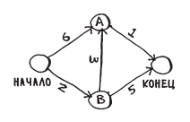

# Исходные данные

## Граф



## Хеш-таблица графа

```python
graph = {}

# создадим внутри общей хеш-таблицы еще одну -- с соседями начального узла
graph["start"] = {}
graph["start"]["a"] = 6
graph["start"]["b"] = 2

# поулчить всех соседей начального узла можно так:
graph["start"].keys{}

# веса ребер можно получить так:
graph["start"]["a"]

# добавим остальных соседей
graph["a"] = {}
graph["a"]["finish"] = 1

graph["b"] = {}
graph["b"]["a"] = 3
graph["b"]["finish"] = 5

graph["finish"] = {} # у конечного узла соседей нет
```

## Хеш-таблица стоимостей узлов графа

```python
infinity = float("inf") # создадим переменную, равную бесконечности

costs = {}
costs["a"] = 6
costs["b"] = 2
costs["finish"] = infinity
```

## Хеш-таблица родителей

```python
parents = {}
parents["a"] = "start"
parents["b"] = "start"
parents["finish"] = None
```

## Массив для хранения обработанных узлов

```python
processed = []
```

# Реализация алгоритма

Функция *find_lowest_cost_node(costs)* ищет узел с наименьшей стоимостью. На первом шаге это узел B со стоимостью 2.

```python
node = find_lowest_cost_node(costs)
cost = costs[node]
```

Затем из соответствующей хеш-таблицы ищутся соседи этого узла (A и finish).

```python
neighbors = graph[node]
```

Осуществляется перебор соседей.

```python
for n in neighbors.keys()
```

Вычисляется путь до соседа от исследуемого узла и сравнивается с расстоянием от начального узла.

Если получилось меньшее расстояние, то стоимость соседа обновляется.

```python
new_cost = cost + neighbors[n] # cost -- стоимость B, neighbors[n] -- расстояние от B до A
if costs[n] > new_cost:
    costs[n] = new_cost
```

Новый путь проходит через B. Поэтому B назначается новым родителем.

```python
parents[n] = node
```

Вычисление повторяется для второго соседа B -- вершины finish.

Путь до конечного узла через вершину B будет равен 7. Т.к. 7 < infinity, то стоимость конечного узла обновится и его родителем станет B.

После того, как все соседи B проверены, узел B считается обработанным.

```python
processed.append(node)
```

Далее ищется следующий узел для обработки. Следующим будет обработан узел А. 

У него всего один сосед -- конечный узел. Путь до него из А будет равен 6. Т.к. 6 < 7, стоимость и родитель конечного узла будут обновлены.

----

Функция поиска узла с наименьшим весом:

```python
def find_lowest_cost_node(costs):
    lowest_cost = float("inf")
    lowest_code_node = None
    for node in costs: # перебираем все узлы
        cost = costs[node]
        if cost < lowest_cost and node not in processed: # если узел с наименьшей стоимостью и не обработан ...
            lowest_cost = cost # он становится новым узлом с наименьшей стоимостью
            lowest_code_node = node
    return lowest_code_node
```

